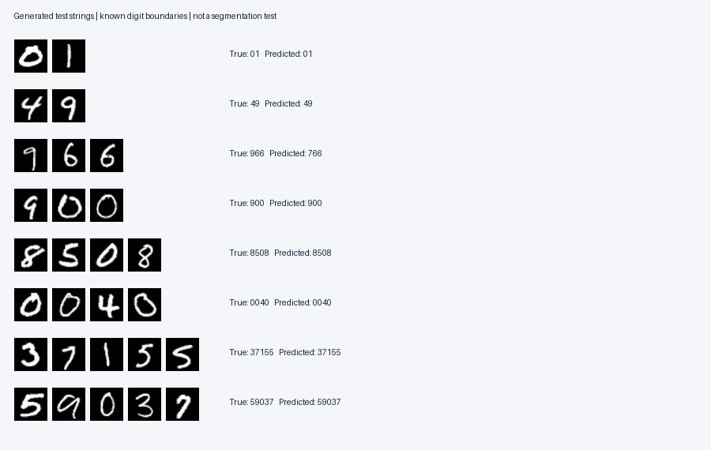

# COS30018 Intelligent Systems project

The machine-learning component for Option B: handwritten number recognition.
The saved baseline supplies the digit classifiers and prediction interface.
The local preprocessing, segmentation and GUI now connect both loaded photos
and generated number images to this predictor.

## Launch the desktop application

From the inner project directory in Windows PowerShell:

```powershell
.\.venv\Scripts\python.exe app.py
```

Use Open a photo to load handwriting, or Generate a number to compose digit
images from a folder. Select a saved model, segmentation method and preprocessing
representation, then Recognise. Export result saves a new evidence folder.

- [Saniru's setup, user guide and code explanation](docs/SANIRU_START_HERE.md)
- [GUI verification record](docs/GUI_VERIFICATION.md)

18 automated tests passed; real-window checks verified both image routes,
exports, selectors, error handling and leading zeros. These are functionality
checks rather than final accuracy evaluation. The alphanumeric extension,
new-image evaluation and final report/video remain separate project work.

#segmentation component

- [Beginner walkthrough and GUI handover](docs/MANULA_START_HERE.md)
- [Verified development comparison and limitations](docs/SEGMENTATION_EXPERIMENT.md)

The updated photo collection contains 40 images. The selected connected-component
method recognises 18/20 multi-digit numbers exactly; projection recognises 17/20.
Correct digit counts are 20/20 versus 19/20 on that subset. Count agreement is not
an annotated segmentation accuracy measure. Final evidence is in
`evidence/segmentation/team_run_02`; all 13 software tests pass.

Run from this directory in Windows PowerShell (choose a new output folder):

```powershell
.\.venv\Scripts\python.exe recognise_photo.py --input "data/segmentation_photos/Manula/Manula_07_label-420.jpg" --output evidence/segmentation/my_manula_demo_01
```

This example predicts `420` and saves a preview showing the ordered digit crops.

## Verified baseline

| Model | Validation accuracy | MNIST test accuracy |
|---|---:|---:|
| MLP | 96.22% | 96.60% |
| CNN | 98.42% | 98.53% |

The CNN was selected using validation results before test evaluation. These are
single-seed, five-epoch benchmark results, not real-photo application accuracy.
The model also reconstructed 957 of 1,000 generated test strings correctly when
given their known digit crops. This does not evaluate segmentation.

## Start here

- [Beginner walkthrough and setup](docs/START_HERE.md)
- [Model comparison and limitations](docs/ML_REPORT.md)
- [Integration instructions for teammates](docs/INTEGRATION.md)
- [Evidence and individual worklog guidance](docs/CONTRIBUTION_RECORD.md)
- [Actual experiment settings](experiments/baseline/config.json)
- [Actual final evaluation](experiments/baseline/evaluation/results.json)

Use Python 3.12. From the repository directory on macOS:

```sh
python3.12 -m venv .venv
source .venv/bin/activate
python -m pip install -r requirements.txt
python -m unittest discover -s tests -v
python -m hnrs_ml.predict --checkpoint experiments/baseline/cnn.pt --crops experiments/baseline/evaluation/example_crops/digit_0.png experiments/baseline/evaluation/example_crops/digit_1.png experiments/baseline/evaluation/example_crops/digit_2.png
```

The supplied demo really predicts **766** for an image labelled **966**. It is a
retained failure example, useful for explaining limitations. The preview below
also includes successful examples. No data download or retraining is needed for
this demo because trained models and the three small crops are included.



To inspect MNIST, run `python inspect_mnist.py`. To reproduce training and final
evaluation in a new output directory:

```sh
python -m hnrs_ml.train --download --output-dir experiments/reproduction
python -m hnrs_ml.evaluate --experiment-dir experiments/reproduction
```

Training and evaluation refuse to overwrite an existing experiment record.
Use validation data for future improvements. Once test results have been examined,
do not repeatedly tune against them and describe that as an untouched final test.

